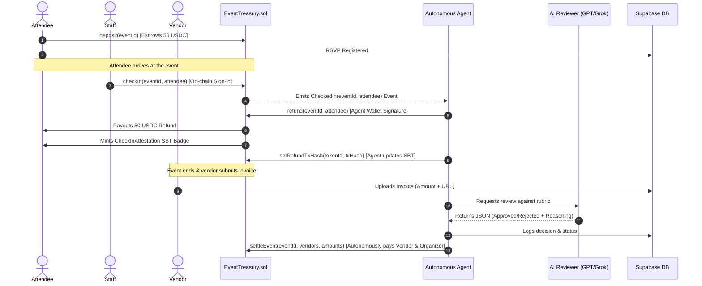

# Aegis Waterfall - Autonomous Event Escrow & Payout Agent

Aegis Waterfall is a stablecoin-native event ticketing, deposit, and vendor settlement platform built and submitted for the **Encode x Arc "Programmable Money Hackathon"**.

By pairing EVM smart contracts on the **Arc Testnet** with a **Circle Developer-Controlled Wallet**, Aegis Waterfall removes all human friction from treasury management: it autonomously refunds attendees the moment they check in, and uses a Large Language Model (LLM) to review, approve, and settle vendor invoices at the close of an event.

---

## 🏆 Track Alignment

1. **Agentic Economy (Primary)**: Aegis Waterfall's core logic is driven entirely by a backend AI agent with its own wallet address granted `AGENT_ROLE` access. The agent autonomously writes transaction proofs, executes refunds, and signs vendor settlements without any human clicking "approve" or signing a transaction payload in the browser.
2. **DeFi (Secondary)**: The platform features a stablecoin-native escrow and payment infrastructure directly on the Arc network, maintaining transparent treasury balances viewable on the dashboard.

---

## 🔮 Architecture Flow



---

## 🛠️ Smart Contracts

Our contracts are written in Solidity, compiled using **Solc 0.8.24** and optimized for the **Paris EVM version** (to avoid incompatible Cancun opcodes such as `PUSH0` on the Arc Testnet).

- **`EventTreasury.sol`**: Manages event registration, deposits, check-ins, agent-restricted refunds, and vendor settlement. Uses OpenZeppelin's `AccessControl` and `ReentrancyGuard`.
- **`CheckInAttestation.sol`**: Soulbound NFT (ERC-721) minted during attendee refund. Generates interactive base64-encoded SVG metadata on-chain to provide immutable check-in audit trails.

### Deployed Testnet Addresses
*   **EventTreasury.sol**: `0x4226F8f9260e1CeD622ebCb0FbE226Bbc5fFe515`
*   **CheckInAttestation.sol**: `0x6758396C5Cc75D0437CfC9F74B7Bfd409193B559`
*   **MockUSDC (Arc Testnet)**: `0x83a0e65D01198133DEa1d6A5f9292A04D7d88371`
*   **Agent Wallet Address**: `0x59e096c540e1ec640bd203012b8525d9fe04eccf`

### Proof of Autonomy (Live Evidence)
The following are verified Arc Testnet transaction hashes entirely initiated, evaluated, and executed by the Autonomous Agent's backend without any human intervention or browser-based payload signature:
*   **Autonomous Refund execution (`refund`)**: `0xc190b272f4fc07a363dbe0002c1c1525539ed7da07e301e5075f2bb681c66acd`
*   **Autonomous Metadata write to SBT (`setRefundTxHash`)**: `0xa080af1b35bd79ab5c75aec3b38a0f88867c77b0efc51ac90cefec1e7fb3d8b2`


## 🤖 How the Agent Acts With No Human In The Loop

1. **Autonomous Refund**: The agent uses `viem` to listen to on-chain `CheckedIn` events. Once detected, the agent constructs and submits a `refund()` transaction signed server-side using the Circle SDK.
2. **Metadata Writing**: After the refund is confirmed, the agent extracts the transaction hash and the minted SBT token ID, calling `setRefundTxHash` to log the audit trail directly on the blockchain.
3. **LLM Invoice Auditing**: The agent polls Supabase for pending vendor invoices. It fetches the event params from the smart contract, runs the metadata through the LLM, and evaluates if the invoice matches the event parameters.
4. **Autonomous Settlement**: Once the event end-time has passed on-chain, the agent queries approved invoices, compiles vendor payout structures, and signs the `settleEvent()` transaction to distribute treasury funds.

---

## 🔒 Security Design

*   **Access Control**: Only the agent's Circle Developer-Controlled Wallet is granted `AGENT_ROLE` on the EventTreasury. Attendees and organizers have no access to refund or settle functions.
*   **Reentrancy Guards**: `nonReentrant` modifiers are implemented on all USDC-withdrawing functions (`refund`, `settleEvent`) to prevent reentrancy attacks.
*   **Key Isolation**: The agent's wallet keys and entity secret are isolated in the backend service, preventing any client-side exposure.

---

## 🚀 Local Setup & Installation

### 1. Database Setup
Register on [Supabase](https://supabase.com), create a new project, and execute the SQL script located in `supabase_schema.sql` in the SQL editor.

### 2. Smart Contracts Setup
```bash
cd contracts
# Copy environment variables
cp .env.example .env
# Compile contracts targeting Paris EVM
forge build
# Run unit tests
forge test
# Deploy to Arc Testnet
forge script script/Deploy.s.sol:DeployScript --rpc-url https://rpc.testnet.arc.network --broadcast
```

### 3. Agent Service Setup
Create a `.env` file in the `agent-treasury` folder matching the `.env.example` configurations.
```bash
cd agent-treasury
# Install dependencies
npm install
# Compile TypeScript
npm run build
# Start the agent
npm start
```
*Note: On first start, the agent will output a newly generated wallet address. Fund this wallet using the [Circle Faucet](https://faucet.circle.com) on Arc Testnet to cover gas.*

### 4. Frontend Dashboard Setup
Create a `.env` file in the `app` folder with your Supabase url and anon key:
```env
VITE_SUPABASE_URL=your_supabase_url
VITE_SUPABASE_ANON_KEY=your_supabase_anon_key
```
```bash
cd app
# Install dependencies
npm install
# Start local development server
npm run dev
```
